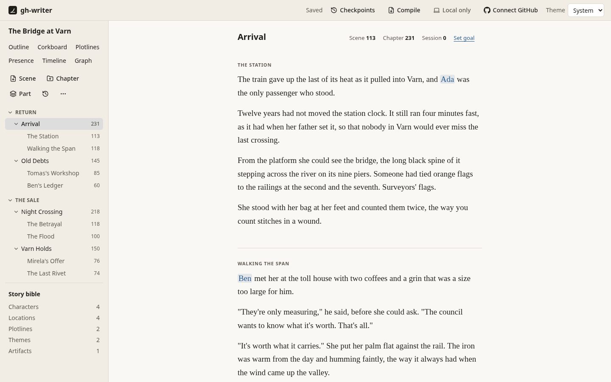
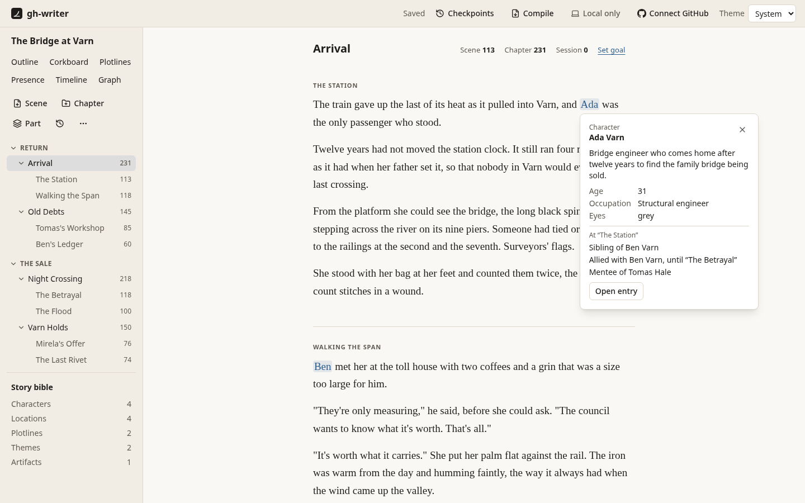
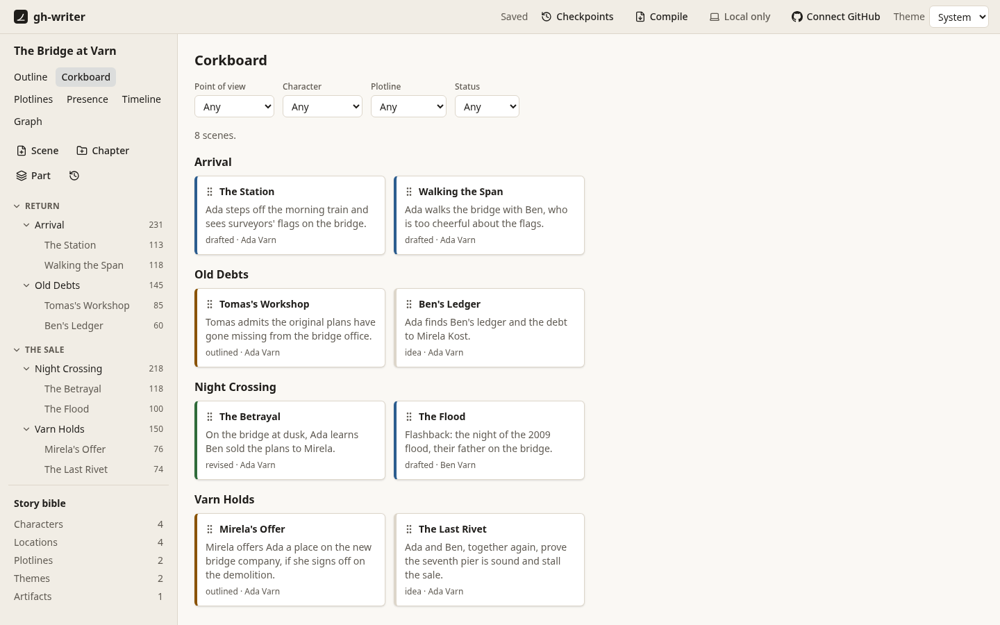
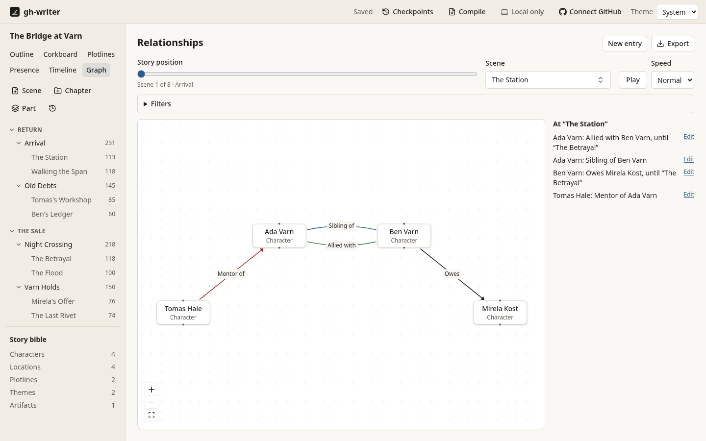
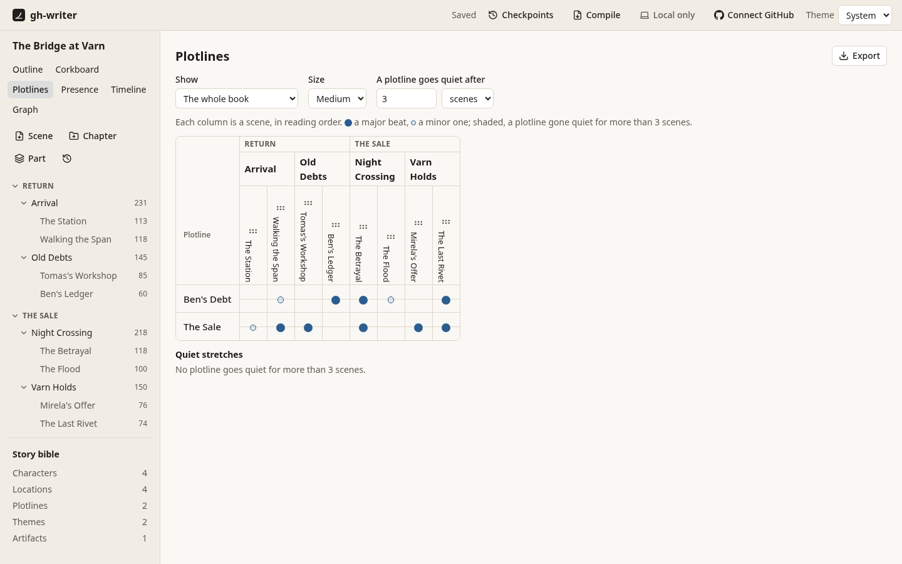
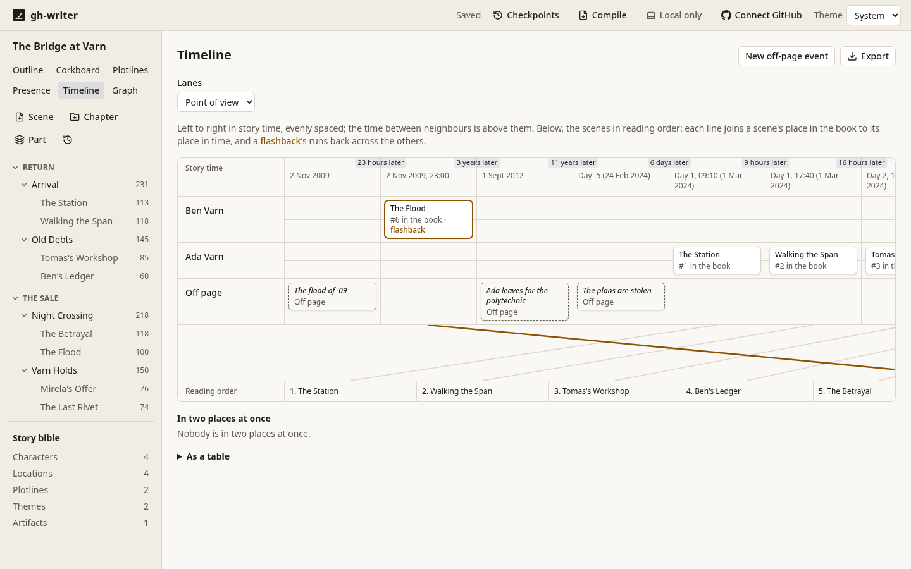
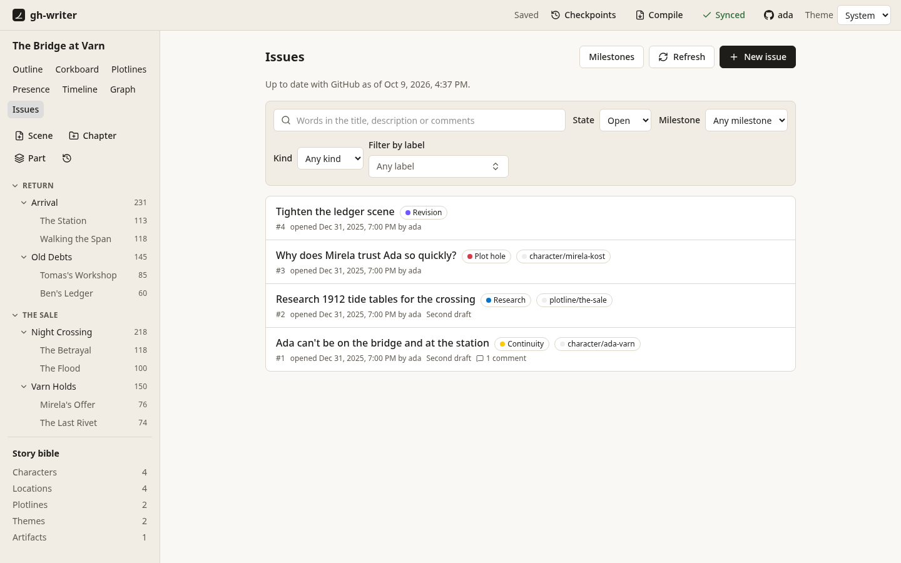

# gh-writer

**Plan and write a novel with GitHub.** gh-writer is a writing app that runs on your own computer and keeps your book as plain Markdown and YAML files in a git repository. You write in a calm, distraction-free editor; your story bible, outline and diagrams sit beside the text; and GitHub keeps every version, backs it up, and tracks the work around the book (plot holes, research, revision notes) as issues. You never have to type a git command.



## Features

### Write

- **A distraction-free editor** for scenes, or a whole chapter as one continuous text while each scene stays its own file. Focus mode, typewriter scrolling, word counts for the scene, chapter and session, and a session goal.
- **Mentions.** Type `@` and a few letters to mention a character, place or anything else in the story bible. Hover over a mention (or press Alt+Enter) for a card showing who they are and how they relate to everyone else *at that point in the story*.
- **Quick entry.** Create a new character, location or entry of your own type straight from the `@` menu or the scene details, without leaving the scene.
- **Spell check** that knows your characters' names, with a per-novel dictionary.
- **Find and replace** across the scene, the chapter or the whole manuscript, with one Undo for everything.
- **Autosave that doesn't lose words**, even if the app or the browser crashes, and conflicts shown side by side if a file changes elsewhere.



### Plan

- **Manuscript structure**: parts, chapters and scenes in a tree you can rearrange with the keyboard or by dragging; an **outline** and a **corkboard** of scene cards, filtered by point of view, character, plotline or status.
- **A story bible** of characters, locations, plotlines, themes and types you invent, with relationships that start and end at particular scenes.
- **Diagrams**, all exportable as SVG (and some as Mermaid):
  - a **relationship graph** with a slider to step through the story and watch alliances change;
  - **plotline swimlanes** showing each plotline's beats scene by scene, and where one goes quiet;
  - **presence matrices** of which characters and themes appear in which scenes;
  - a **timeline** setting story time against reading order, flashbacks and off-page events included.

<table>
  <tr>
    <td></td>
    <td></td>
  </tr>
  <tr>
    <td></td>
    <td></td>
  </tr>
</table>

### Work with GitHub

- **Sync** with a GitHub repository in the background, and **checkpoints**: named points in the book's history to restore the whole manuscript, or a single scene, from.
- **Sign in once in the app**; the token stays in your OS keychain. Start a new novel, clone one, or put a local novel on GitHub, all from the app.
- **Issues for the work around the book**: plot holes, continuity errors, research questions and revision notes, with kinds, labels for the characters, plotlines and themes involved, and milestones. Select a passage to raise an issue about it; a marker in the margin leads back to it. Changes made offline go to GitHub when it can be reached.
- **Diagram snapshots on github.com**: a workflow redraws the diagrams into the repository on every push, so they show up when you browse it.



### Compile

- **Compile the manuscript**, or a range of chapters, to **Word** in standard manuscript format (ready for agents and editors), **EPUB** (checked by epubcheck) and **PDF**. Presets in `compile.yaml` set the title page, chapter headings, scene breaks, and front and back matter.
- **A Release for every named checkpoint**: a workflow in the novel's repository compiles the book and attaches the files. The same commit gives byte-identical files in the app and on GitHub.

### Your files, your way

Everything is in plain files: one Markdown file per scene, one per bible entry, YAML for structure and relationships. You can edit them on github.com or in any text editor, and a validator (run on every push) catches broken references. The format is specified in [docs/format/v1.md](docs/format/v1.md).

The app is keyboard-first and accessible: a command palette (Ctrl+K / ⌘K) reaches everything, every view works without a mouse, it follows your light or dark setting, and its screens are checked with axe in the test suite.

## Getting started

You need [Node.js](https://nodejs.org) 22.18 or later and [git](https://git-scm.com).

```sh
git clone https://github.com/heffrey78/gh-writer
cd gh-writer
npm install
npm run build
npx gh-writer serve
```

Your browser opens on your library, where you can start a new novel, open a folder or clone one from GitHub. To try the sample novel, *The Bridge at Varn*: `npx gh-writer serve examples/sample-novel`.

- **[USER.md](USER.md)**: the guide for writers: the library, writing, the story bible, diagrams, GitHub, compiling and the command line.
- **[DEVELOPER.md](DEVELOPER.md)**: the guide for contributors: architecture, packages, tests and conventions.

## Roadmap

Built and validated so far: the repository format and template, local-first saving and sync, manuscript structure, the editor, the story bible, mentions, the app shell, GitHub sign-in, issues and passage notes, entity labels, quick entry, all four diagrams and their snapshots on github.com, and compiling to DOCX, EPUB and PDF.

Next, as tracked in [the project's issues](https://github.com/heffrey78/gh-writer/issues):

| Feature | What it adds |
|---|---|
| [Named drafts and alternate versions](https://github.com/heffrey78/gh-writer/issues/17) | Try a different ending or cut a subplot as a version of the book, compare any two versions word by word, and adopt one wholesale or scene by scene. |
| [Drafting pipeline on a GitHub Projects board](https://github.com/heffrey78/gh-writer/issues/11) | Each scene's status (outlined, drafted, revised, final), point of view and word count on a board, table and roadmap, kept in sync with the scene files. |
| [Writing statistics and goals](https://github.com/heffrey78/gh-writer/issues/20) | Words written per day, progress toward a target length and deadline, and chapter and scene length charts, all from the repository's history. |
| [Editorial review through pull requests](https://github.com/heffrey78/gh-writer/issues/18) | Open a revision pass for review; editors comment on lines on github.com, and the comments appear in the editor's margin beside the passage. |

gh-writer isn't packaged yet: for now it runs from a clone of this repository, as above.

## License

[MIT](LICENSE.md). The bundled Liberation Serif fonts, used for PDFs, are under the SIL Open Font License 1.1.
