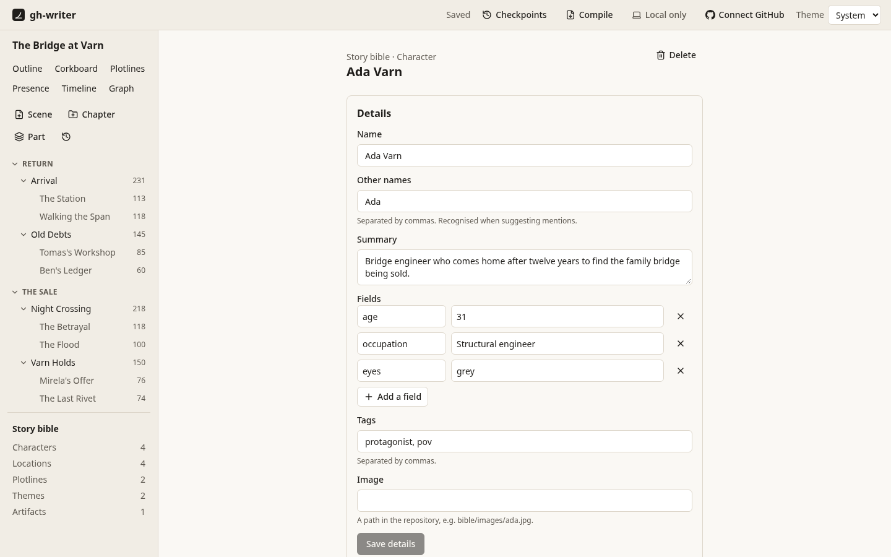
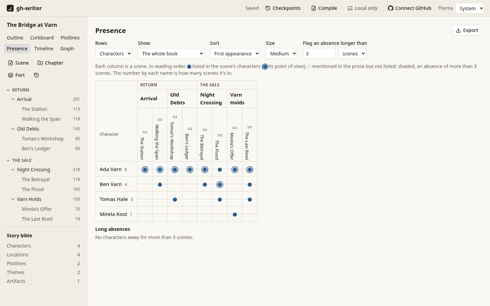
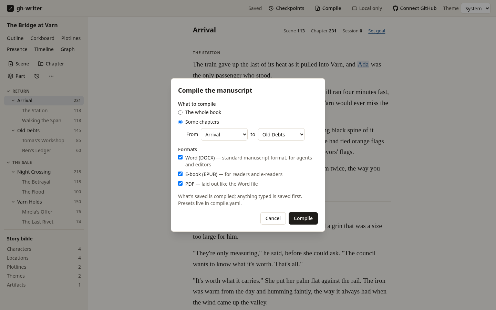
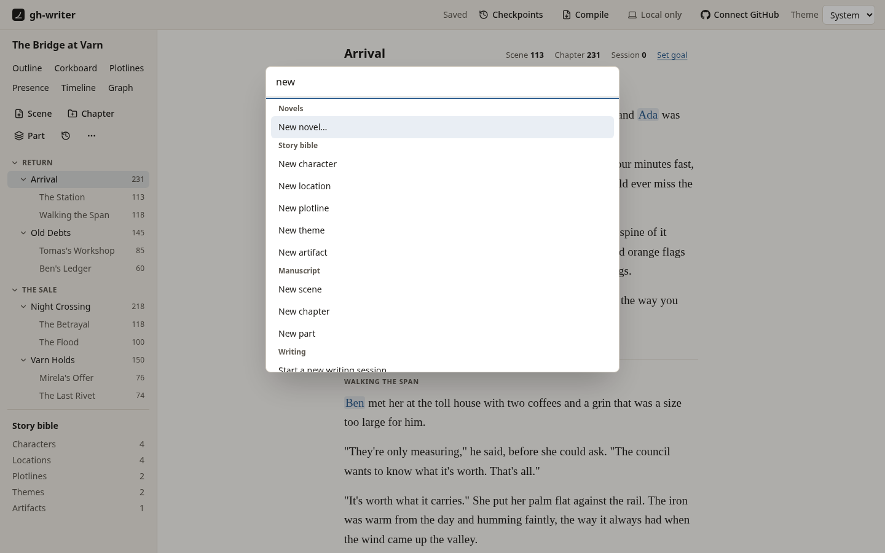

# gh-writer for writers

This guide is for the person writing the book. It assumes gh-writer is installed and running (see [Getting started](README.md#getting-started)). You don't need to know git or GitHub: gh-writer uses them for you, and this guide says what happens in plain terms.

**Contents:** [Your library](#your-library) · [Writing](#writing) · [Structure](#structure-parts-chapters-and-scenes) · [The story bible](#the-story-bible) · [Diagrams](#diagrams) · [Saving, sync and checkpoints](#saving-sync-and-checkpoints) · [GitHub](#github) · [Issues](#issues) · [Compiling](#compiling) · [Keyboard](#keyboard) · [Your files](#your-files) · [The command line](#the-command-line)

## Your library

`npx gh-writer serve` opens your library in the browser: the novels on this computer, most recently opened first. From there:

- **New novel** starts one from the novel template, in `~/gh-writer/<title>` unless you choose another folder. The first time, gh-writer may ask who's writing: the name and email that sign your saved work.
- **Open a folder** adds a novel already on this computer.
- **Clone from GitHub** copies a novel from GitHub, after you've connected (see [GitHub](#github)), listing your repositories to choose from.

`npx gh-writer serve path/to/novel` opens one novel directly. Taking a novel out of the library leaves its folder alone.

## Writing

Choose a chapter or scene in the tree on the left. A chapter opens as one continuous text with each scene's title at its boundary; you can move between scenes freely, though typing can't merge or delete them by accident. Word counts for the scene, the chapter and this session are at the top, with **Set goal** for a session goal.

- **Formatting:** Ctrl+I italic, Ctrl+B bold, Ctrl+Shift+B block quote, Ctrl+Enter section break, Shift+Enter line break. Typing Markdown works too: `*word*` for italic, `> ` for a quote, `***` for a break. (On a Mac, ⌘ for Ctrl throughout.)
- **Focus mode** (Ctrl+Shift+F) hides everything but the text. **Typewriter scrolling** (Ctrl+Shift+L) keeps the line you're on steady on the screen.
- **Mentions:** type `@` and a few letters to mention someone or something from the story bible; ↑ ↓ and Enter to choose. A mention keeps its words in the text and stays linked if the entry is renamed. Hover over one, or press Alt+Enter beside it, for its card: who or what it is, and its relationships at this point in the story.
- **Quick entry:** under **New entry** at the bottom of the `@` list, *New character “Mira”*, *New location “Mira”* and so on create an entry named what you typed and mention it, without leaving the text. Fill in the rest later.
- **Spell check** knows the story bible's names. Ctrl+. (or a right-click) on an underlined word offers suggestions, **Add to dictionary** (the novel's own `dictionary.txt`) and **Ignore**.
- **Find** (Ctrl+F) searches the scene, chapter or whole manuscript; **Find and replace** (Ctrl+Shift+H) replaces across all of it, with one Undo.
- **Scene details** (in the command palette: *Show scene details*) opens a panel beside the text with the scene's point of view, status (idea, outlined, drafted, revised, final), synopsis, characters, locations, plotlines and their beats, themes, tags and when it happens in story time.

## Structure: parts, chapters and scenes

The tree on the left holds the book. **Scene**, **Chapter** and **Part** add one after the selection; F2 renames, Alt+↑ / Alt+↓ move, Delete deletes (deleted things wait in **Recently deleted**). You can drag in the tree, too. In the command palette, *Split the scene at the caret*, *Merge scene with the next* and *Move scene to chapter…* reshape scenes.

- **Outline** lists every scene with its synopsis, status, point of view, characters, plotlines and word count; edit the synopsis and status in place, and drag to reorder.
- **Corkboard** shows scenes as cards by chapter. Filter by point of view, character, plotline or status; drag cards to reorder.

## The story bible

**Story bible** in the left panel lists characters, locations, plotlines, themes and any types of your own (an "Artifacts" type in the sample novel, say). Each entry has a name, other names (recognised when you type `@`), a summary, fields of your choice, tags and notes.

Relationships (sibling of, mentor of, allied with…) live on the entries' pages, each from a scene and, if it ends, until a scene. The kinds of relationship are yours to define in `novel.yaml`. Off-page events, like a flood years before the story starts, live on the **Timeline**.



## Diagrams

Each has an **Export** button for SVG; the graph and timeline also export Mermaid.

- **Graph**: the relationship graph. Drag the *Story position* slider, or press **Play**, to see relationships begin and end as the story goes. Arrange nodes by dragging; the layout is saved.
- **Plotlines**: a row per plotline, a column per scene, with major and minor beats; stretches where a plotline goes quiet too long are shaded and listed.
- **Presence**: which characters (or themes) are in which scenes.
- **Timeline**: the book in story time, joined by lines to reading order, so flashbacks stand out; and anyone who is in two places at once is listed.



## Saving, sync and checkpoints

**Saving is automatic.** The header says *Saved*, *Saving…* or *Unsaved*; typed words are kept even if the app or the browser closes unexpectedly. If a file you're editing changes somewhere else (another computer, or a text editor), gh-writer shows both versions side by side so you choose what to keep.

**Sync**: with a novel on GitHub, gh-writer brings in changes and sends yours every few minutes, and when you choose *Sync now*. The header shows whether you're synced. If the same passage was changed in two places, *Resolve sync conflicts* walks you through each one.

**Checkpoints** are named points in the book's history, like "Before the big cut". Make one from **Checkpoints** in the header. Later, restore the whole manuscript and story bible from it, or just one scene. A restore first takes a checkpoint of its own, so a restore can always be undone.

## GitHub

**Connect GitHub** in the header signs you in: gh-writer shows a code to enter on github.com. If you already use GitHub's `gh` command, you can sign in with that instead. Your sign-in stays in your computer's keychain.

A novel that's only on this computer says **Local only** in the header; choose it to **put it on GitHub** as a new private or public repository. From then on it syncs, and the GitHub features below appear; for a local-only novel they stay out of the way.

On github.com, the novel's repository shows the book as files, keeps every version, and runs a few automatic workflows: **Validate** checks the files on every push, **Diagrams** redraws the diagram snapshots into `diagrams/`, and **Compile** makes a Release for each named checkpoint (see [Compiling](#compiling)).

## Issues

Issues are for the work around the book: plot holes, continuity errors, research questions, ideas and revision notes. (Story facts belong in the story bible.) They're GitHub issues, so you can also see and edit them on github.com.

- **Issues** in the views lists them, with search and filters for state, kind, label and milestone. **New issue** creates one; **Milestones** organises them (e.g. "Second draft").
- **Kinds** (plot hole, continuity, research, idea, revision) are labels with colours.
- **Labels for the story**: every character, plotline and theme has a label (`character/ada-varn`), so you can filter for everything about Ada.
- **About a passage**: select some text and right-click, or use *Raise an issue about the selection…*. The issue quotes the passage and gets labels for the people and places in the scene. A marker in the margin shows which paragraphs have issues; choose it to read and comment beside the text.
- **Offline**, changes wait and are sent when GitHub can be reached again.

## Compiling

**Compile** in the header (or *Compile the manuscript…*) makes the book into files to share:

- **Word (DOCX)** in standard manuscript format, for agents and editors: a title page with your contact details and word count, Times New Roman 12 pt double-spaced, a running header, chapters on new pages, "THE END".
- **E-book (EPUB)** for readers and e-readers.
- **PDF**, laid out like the Word file.

Compile the whole book or a range of chapters. Anything you've just typed is saved first. Presets in a `compile.yaml` file in the novel set the title page details, chapter headings ("Chapter Four: The Flood", or just the number or title), the scene break marker, and front and back matter such as a dedication; see the [format spec](docs/format/v1.md#compileyaml).

**On GitHub**, every named checkpoint you make becomes a Release of the novel's repository with the three files attached, and *Actions → Compile → Run workflow* compiles on demand. The files are identical to the app's for the same saved version.

> **A novel started before compiling existed** doesn't have the Compile workflow yet. [Upgrading a novel's tools](docs/format/v1.md#upgrading-a-novels-tools) says which files to copy in from the template.



## Keyboard

Everything is reachable from the keyboard. **Ctrl+K** opens the command palette, which can do anything in the app: go to a chapter or scene, open a view, make a checkpoint, sync, change the theme. **Ctrl+/** lists the keyboard shortcuts.



## Your files

A novel is a folder of plain files you can read and edit anywhere: on github.com, in a text editor, or by hand.

```
novel.yaml           title, author, word target, kinds of relationship
compile.yaml         compile presets (optional)
dictionary.txt       words the spell checker accepts
manuscript/          parts, chapters (folders) and scenes (Markdown files)
bible/               one file per character, location, plotline, theme…
bible/relationships.yaml
bible/events.yaml    off-page events
diagrams/            generated diagram snapshots
```

Write each paragraph on one line, and don't change the IDs (`char_7f3k2q`). The novel's own README explains more, and the [format spec](docs/format/v1.md) says everything.

## The command line

From the gh-writer folder:

| Command | Does |
|---|---|
| `npx gh-writer serve [dir]` | Start the app; with a folder, open that novel. `--port`, `--no-open`, `--sync-every <minutes>` |
| `npx gh-writer validate [dir]` | Check a novel's files for broken references and other problems |
| `npx gh-writer snapshots [dir]` | Redraw the diagram snapshots in `diagrams/` |
| `npx gh-writer compile [dir]` | Compile to `compiled/` in the novel. `--format docx,epub,pdf`, `--preset`, `--from`/`--to` (chapter IDs), `--out` |
| `npx gh-writer new-id <prefix>` | A new ID, for editing files by hand |

In a novel's own folder, without gh-writer installed, the same tools run as `node .github/gh-writer/validate.mjs`, `snapshots.mjs` and `compile.mjs`.
