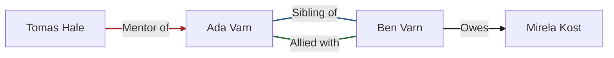
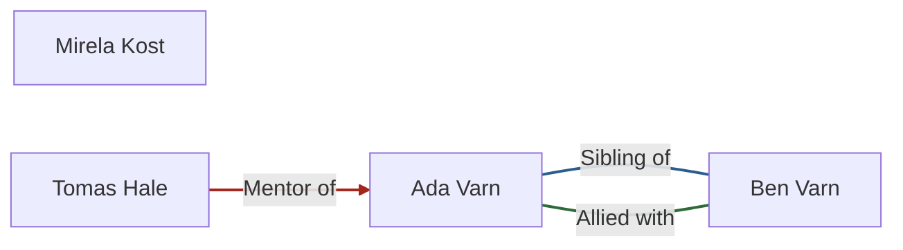
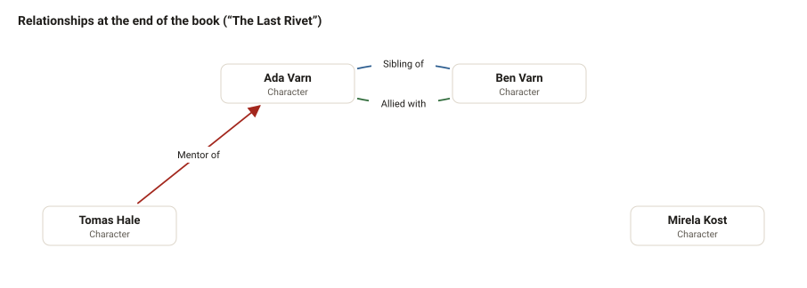
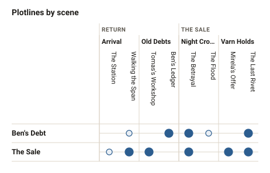
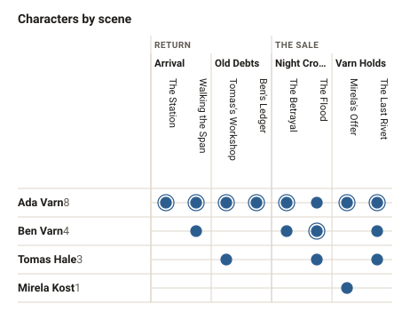
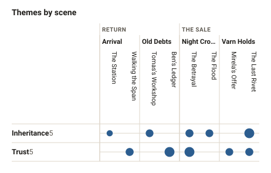
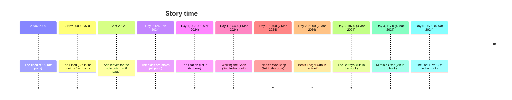
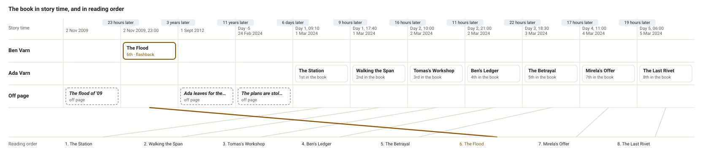

# Diagrams of The Bridge at Varn

_Generated by gh-writer from the novel's files: don't edit, it's rewritten when the story changes. Open the novel in gh-writer for the live, editable views._

## Relationships

At the start of the book (“The Station”):

At the end of the book (“The Last Rivet”):

As drawn in gh-writer, where the nodes are placed by hand:

## Plotlines

Each column is a scene, in reading order: a large dot is a major beat, a small one a minor beat. Shaded: a plotline gone quiet for longer than the novel's threshold.

## Presence

Filled where the scene lists them (ringed: its point of view; for themes, larger for a stronger one), dashed where the prose only mentions them. The number by each name is how many scenes it's in; shaded, an absence of more than three scenes.

## Timeline

When things happen in the story, next to where they come in the book.

